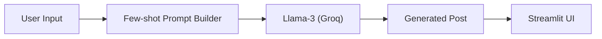

# GenAI LinkedIn Post Generator using Llama-3, LangChain & Groq

A Streamlit-based application that leverages the power of Llama 3 via Groq to generate engaging LinkedIn posts. This tool uses few-shot learning to tailor posts based on selected topics, length, and language.

## 🚀 Project Impact
*Why should you care about this project?*

👉 **Helps professionals create high-quality LinkedIn posts in seconds**  
👉 **Reduces content creation time by ~80%**  
👉 **Demonstrates production-style LLM orchestration**

## 🌟 Features

-   **Topic Selection**: Choose from a dynamic list of topics derived from real successful posts.
-   **Length Modification**: Generate Short, Medium, or Long posts according to your needs.
-   **Multi-Language Support**: Create content in English or Hinglish (Hindi + English).
-   **Few-Shot Learning**: Uses existing high-performing posts as context to match the tone and style.
-   **Fast Inference**: Powered by Groq's LPU inference engine for near-instant generation.

## 🧠 Architecture




## 🛠️ Tech Stack

-   **Frontend**: [Streamlit](https://streamlit.io/)
-   **LLM Integration**: [LangChain](https://www.langchain.com/)
-   **Model**: Llama-3.3-70b-versatile (via Groq)
-   **Data Handling**: Pandas

## 📂 Project Structure

```bash
linkedin-post-generator/
├── main.py              # Application entry point (Streamlit UI)
├── post_generator.py    # Logic for prompt construction and generation
├── few_shot.py          # Handling few-shot examples
├── preprocess.py        # Data cleaning and metadata extraction
├── llm_helper.py        # LLM initialization
├── data/
│   ├── raw_posts.json   # Source data
│   └── processed_posts.json # Enriched data with metadata
├── requirements.txt     # Python dependencies
└── README.md            # Project documentation
```

## 🚀 Getting Started

1.  **Clone the repository**
    ```bash
    git clone https://github.com/Sam-Adarsh/GenAI-Linkedin-Post-Generator.git
    cd GenAI-Linkedin-Post-Generator
    ```

2.  **Create a virtual environment (optional but recommended)**
    ```bash
    python -m venv .venv
    source .venv/bin/activate  # On Windows: .venv\Scripts\activate
    ```

3.  **Install Dependencies**
    ```bash
    pip install -r requirements.txt
    ```

4.  **Set up Environment Variables**
    Create a `.env` file in the root directory and add your Groq API key:
    ```env
    GROQ_API_KEY=your_groq_api_key_here
    ```

5.  **Run the App**
    ```bash
    streamlit run main.py
    ```

## 👨‍💻 Author

**Adarsh S**  
B.Tech in Artificial Intelligence & Data Science (2024)  
Interested in Generative AI, LLM Applications, and Production AI Systems.
